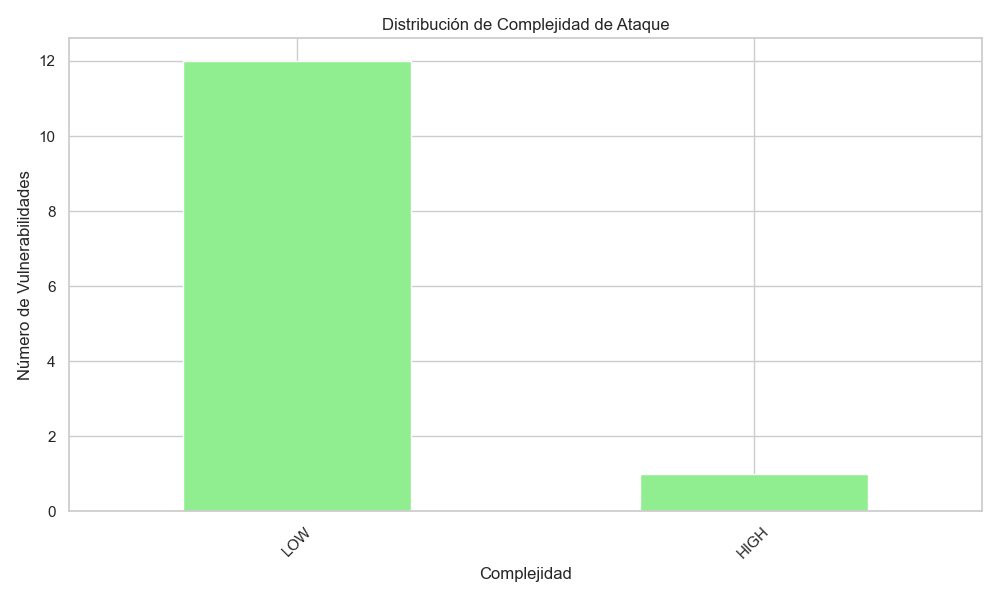
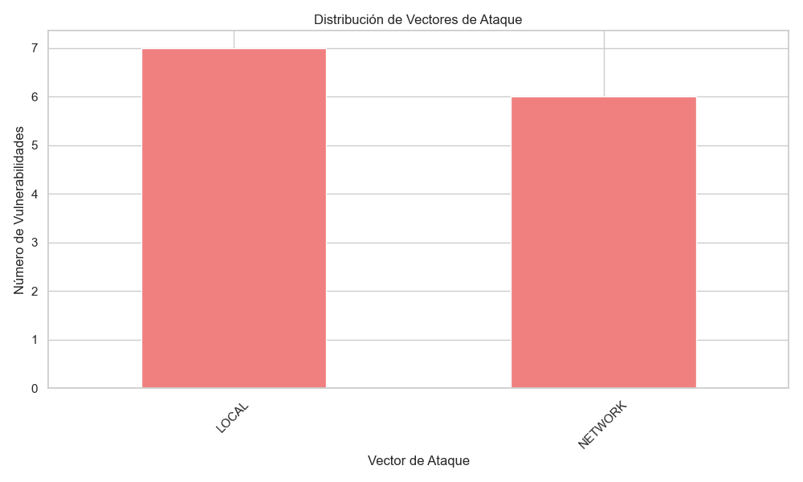
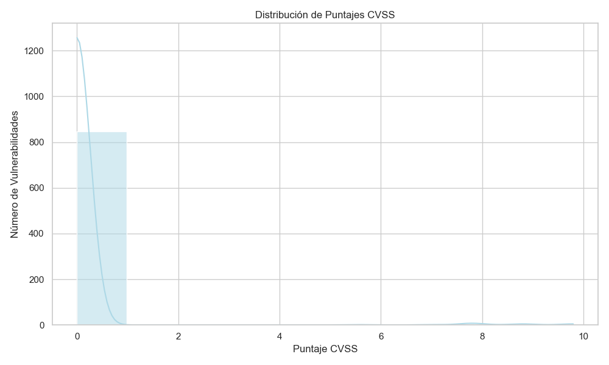
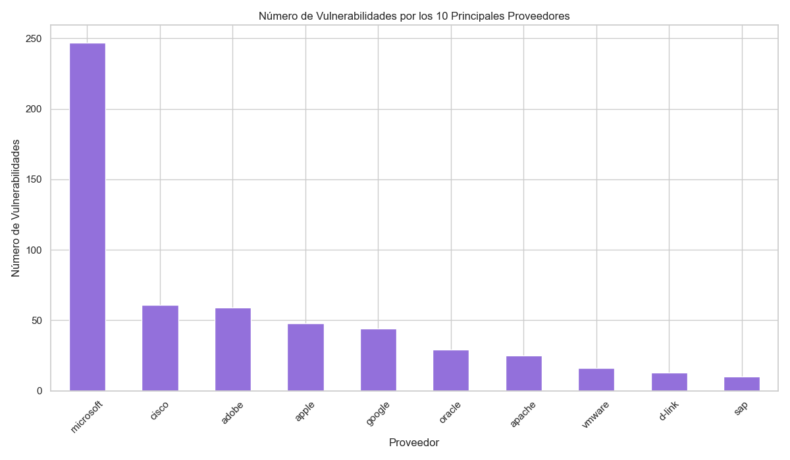
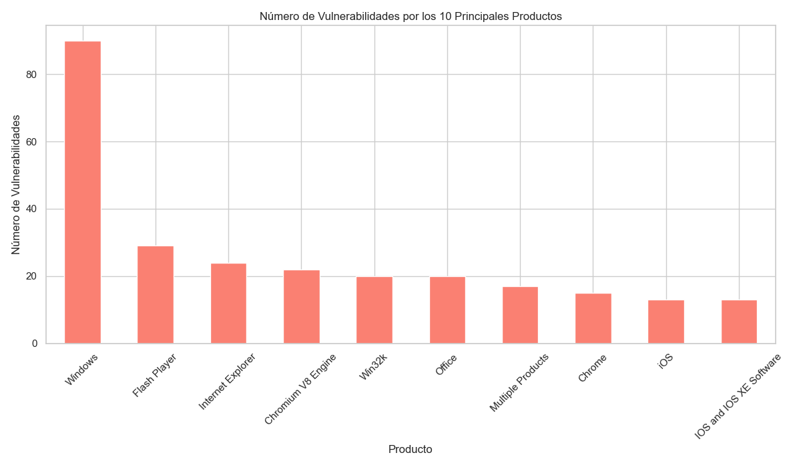

# Cybersecurity Vulnerabilities Analysis

This project focuses on analyzing and visualizing cybersecurity vulnerabilities across the United States, as reported in the CISA Known Exploited Vulnerabilities catalog for 2022. The dataset offers an in-depth exploration of various security vulnerabilities, detailing their types, severity levels, CVSS scores, vendor projects, product names, attack vectors, complexity ratings, and required actions.

>[!NOTE]
>This project was originally done in Spanish, so some names and references are written in Spanish, I will update it soon.

## Project Goals

By analyzing this dataset, the project aims to:

- **Identify Vulnerability Types**: Categorize vulnerabilities to understand the most common types.
- **Assess Severity Levels**: Evaluate the distribution of severity levels to prioritize mitigation efforts.
- **Examine CVSS Scores**: Analyze CVSS scores to gauge the potential impact of vulnerabilities.
- **Analyze Attack Vectors**: Understand the common attack vectors to better defend against them.
- **Evaluate Attack Complexity**: Assess the complexity of attacks to prioritize resources effectively.
- **Summarize Required Actions**: Review recommended actions to mitigate each vulnerability.
- **Identify Affected Vendors and Products**: Highlight the vendors and products most affected by vulnerabilities.

## Visualizations

To provide a comprehensive understanding, the project includes several visualizations:

1. **Distribution of Vulnerability Severity**: Visual representation of the severity levels of vulnerabilities. 
2. **Distribution of Attack Complexity**: Breakdown of vulnerabilities based on the complexity of attacks. 
3. **Distribution of Attack Vectors**: Analysis of the vectors through which attacks are carried out. 
4. **Distribution of CVSS Scores**: Histogram showing the range and frequency of CVSS scores. (Working on it) 
5. **Number of Vulnerabilities by Top Vendors**: Bar chart highlighting the vendors with the most reported vulnerabilities. 
6. **Number of Vulnerabilities by Top Products**: Bar chart identifying the products with the highest number of vulnerabilities. 

>[!NOTE]
This analysis provides valuable insights into the landscape of cybersecurity vulnerabilities, enabling better preparation and protection strategies. By understanding the nature, severity, and vectors of these vulnerabilities, organizations can prioritize their security efforts and mitigate potential risks more effectively.
